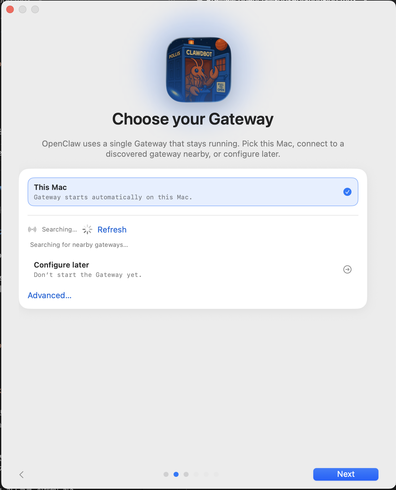
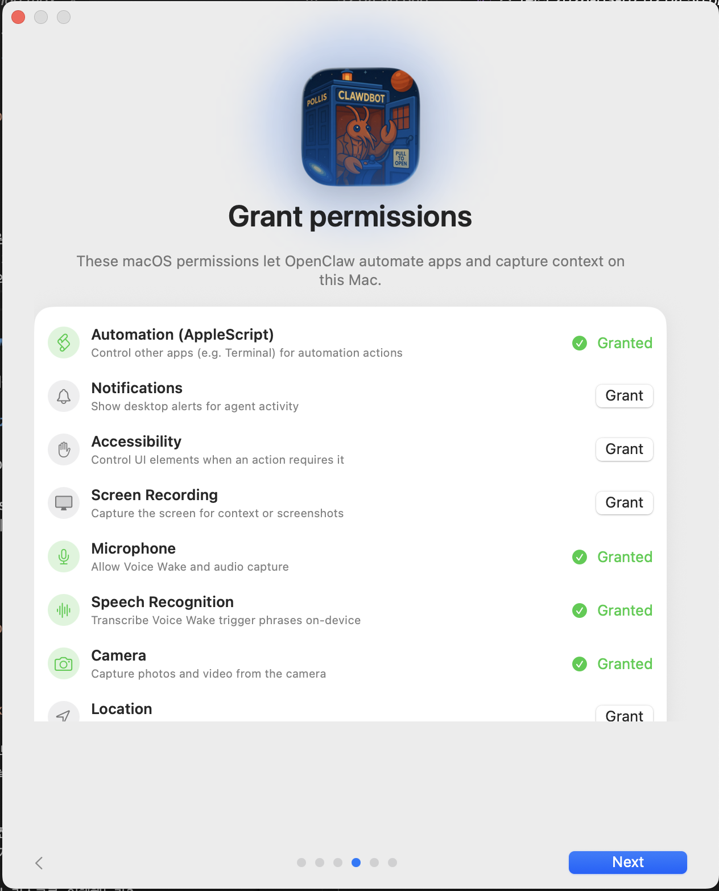
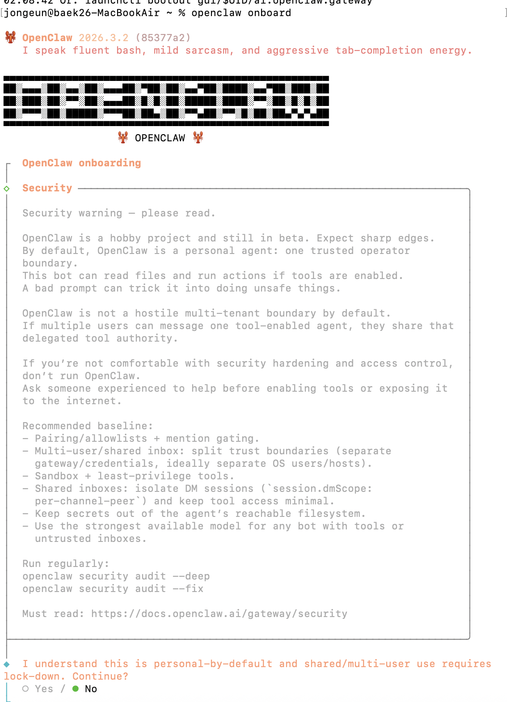
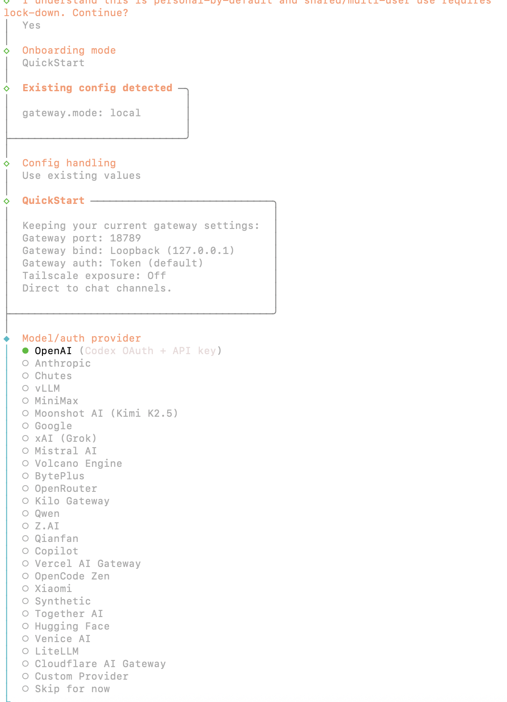
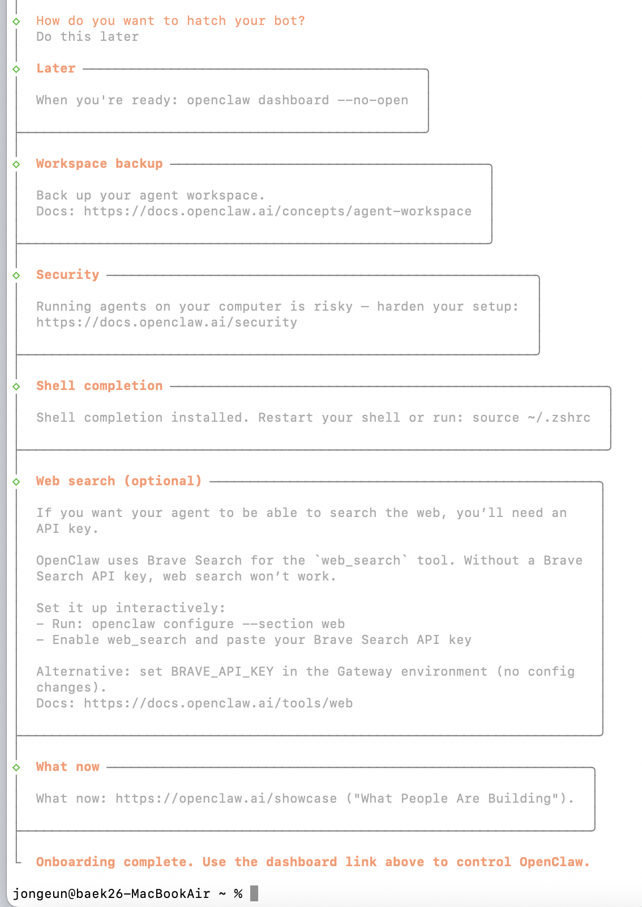
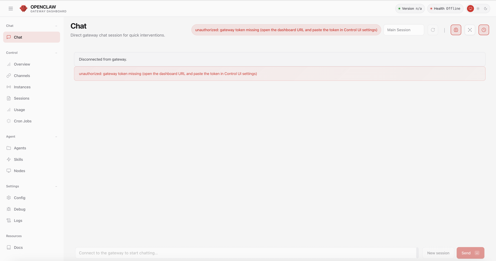
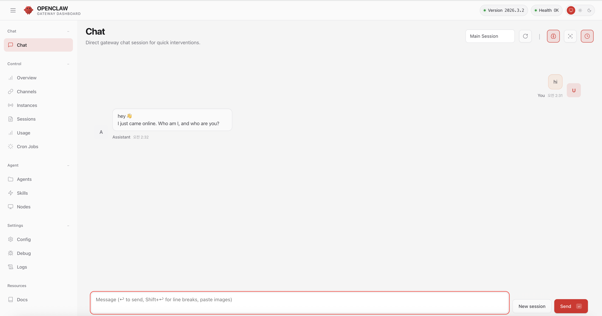
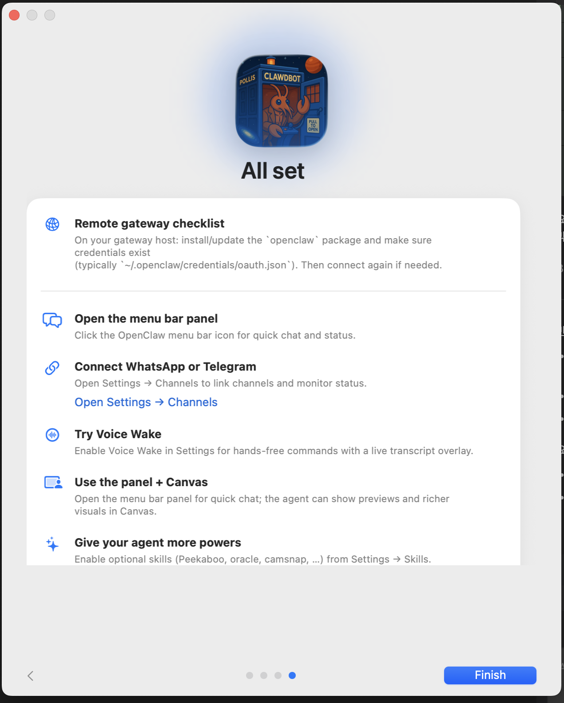
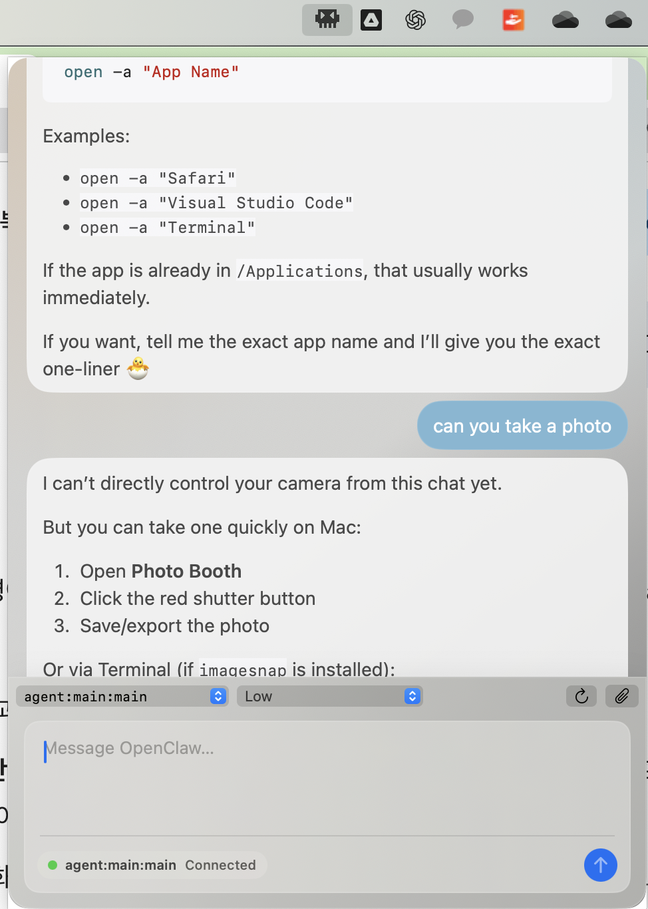

# OpenClaw 실행 관찰 로그

  이 문서는 설명서 요약이 아니라, 실제로 수행한 단계와 확인된 결과만 기록한다.

## 01. 앱 진입 화면 확인

- 확인 사항: OpenClaw 시작 화면 및 보안 경고 문구 노출
- 결과: 설치/온보딩 플로우 진행

## 02. Gateway 선택 (`This Mac`)

- 수행: `Next` 후 게이트웨이 선택 화면 진입
- 선택: `This Mac` (로컬 실행)
- 결과: 로컬 게이트웨이 기동 단계로 진행

## 03. Setup Wizard 오류 발생

- 관찰 에러: `Gateway did not become ready`
- 수행:
1. `npm install -g openclaw@latest`
2. `openclaw gateway --port 18789`

- 실제 터미널 결과 요약:
1. 설치 완료: `added 694 packages in 58s`
2. 실행 시 충돌: `gateway already running (pid 81744)`
3. 포트 점유: `Port 18789 is already in use`
4. 점유 프로세스: `openclaw-gateway (127.0.0.1:18789)`

- 결론: 게이트웨이 미실행 문제가 아니라, **이미 실행 중인 인스턴스와 중복 기동 충돌** 상태

## 04. macOS 권한 4개 허용

- 실제 허용: `Automation`, `Microphone`, `Speech Recognition`, `Camera`
- 결과: 권한 단계 통과

## 05. Pairing Required 에러 확인

- 관찰 에러:
`gateway connect: connect to gateway @ ws://127.0.0.1:18789: pairing required`

- 의미(실행 기준): 게이트웨이는 떠 있지만 앱-게이트웨이 페어링 미완료
- 수행 예정 명령: `openclaw onboard`

## 06. `openclaw onboard` 진행 화면 확인

- 확인 사항:
1. `OpenClaw onboarding > Security` 단계 진입
2. 보안 고지 확인 화면 표시
3. `Continue? (Yes / No)` 확인 단계 도달

- 상태: 온보딩 진행 중 (해당 스크린샷 시점)

## 07. `openclaw onboard` 설정 선택 단계

- 확인 사항:
1. `onboarding mode: QuickStart` 선택됨
2. `Existing config detected` 확인 (`gateway.mode: local`)
3. `Config handling: use existing values` 확인
4. 현재 게이트웨이 값 유지 확인
`port 18789`, `loopback(127.0.0.1)`, `auth token(default)`
5. `Model/auth provider` 선택 화면 진입
`OpenAI (Codex OAuth + API key)`가 선택된 상태

- 상태: 온보딩에서 모델/인증 제공자 선택 진행 중

## 08. 인증 진행 상태 업데이트

- 수행: `Codex`로 로그인 완료
- 결과: provider 인증 단계 통과
- 다음 단계: 온보딩 남은 항목 완료 후 앱 `Refresh`로 연결 상태 확인

## 09. `openclaw onboard` 종료 확인

- 확인 사항:
1. `Onboarding complete. Use the dashboard link above to control OpenClaw.` 메시지 출력
2. 선택값 확인: `How do you want to hatch your bot? -> Do this later`
3. 셸 설정 완료 안내: `Shell completion installed` (필요 시 `source ~/.zshrc`)
4. 웹 검색은 선택 항목으로 안내됨(`Web search (optional)`)

- 결과: CLI 온보딩 절차 종료, 터미널 프롬프트 복귀

## 10. Web UI 접속 후 세팅 부족 상태 확인

- 확인 사항:
1. 대시보드 Chat 화면에서 `Disconnected from gateway` 표시
2. 에러 배너:
`unauthorized: gateway token missing (open the dashboard URL and paste the token in Control UI settings)`
3. 우상단 상태: `Version n/a`, `Health Offline`

- 결론: Web UI 접근은 되었지만, Control UI에 gateway token이 설정되지 않아 인증/연결이 막힌 상태

## 11. Web UI 채팅 동작 확인 (설정 완료 후)

- 확인 사항:
1. 우상단 상태가 `Version 2026.3.2`, `Health OK`로 표시
2. Chat 화면에서 사용자 메시지(`hi`) 전송 확인
3. Assistant 응답 수신 확인

- 결론: Web UI 기준으로는 게이트웨이 연결 및 채팅 기능이 정상 동작

## 12. Mac 앱 완료 화면 도달

- 확인 사항:
1. 앱 온보딩에서 `All set` 완료 화면 표시
2. 하단 `Finish` 버튼 노출
3. 체크리스트 항목(메뉴바 패널, 채널 연결, Voice Wake 등) 안내 화면 확인

- 결론: Mac 앱도 온보딩 완료 단계까지 도달

## 13. Device 승인으로 Mac 앱 실행 이슈 해소

- 수행 명령:
`openclaw devices approve --latest`

- 실제 결과:
`Approved 5b72c86fffdb9838124885c86719779bca9f4e3e320a2fa5c6fa945df0050026 (7b621bc9-3932-486c-9865-24d686b89408)`

- 추가 관찰:
1. 실행 중 doctor warning 노출
`channels.telegram.groupPolicy="allowlist"`인데 `groupAllowFrom/allowFrom`이 비어 있어 group 메시지가 드롭될 수 있음
2. 사용자 보고 기준으로, 이 승인 전에는 Mac 앱 실행이 되지 않았음

- 결론: Mac 앱 실행 문제의 핵심 원인은 **디바이스 승인 대기 상태**였고, `approve --latest`로 해소됨

## 14. Mac 앱 채팅 화면 연결 상태 확인

- 확인 사항:
1. 맥 앱 채팅 화면에서 입력창/메시지 버블 노출
2. 하단 상태 표시: `agent:main:main Connected`
3. 앱 내부에서 대화 안내 응답이 표시됨

- 결론: 맥 앱에서도 채팅 세션 연결 상태 확인

---

## 현재 상태 요약

1. 로컬 게이트웨이 프로세스는 이미 실행 중임 (`127.0.0.1:18789`, pid 81744 로그 확인)
2. `openclaw onboard`는 `QuickStart + 기존 local gateway 설정 유지`로 완료됨
3. provider 인증은 `Codex 로그인`으로 진행됨
4. Web UI는 최종적으로 `Health OK` 상태에서 채팅 송수신까지 확인됨
5. Mac 앱 실행 이슈는 `openclaw devices approve --latest` 이후 해소됨
6. Mac 앱 채팅 화면에서도 `Connected` 상태 확인됨
7. Telegram 경고는 별도 설정 미흡 이슈로 남아 있음(`groupAllowFrom/allowFrom`)
